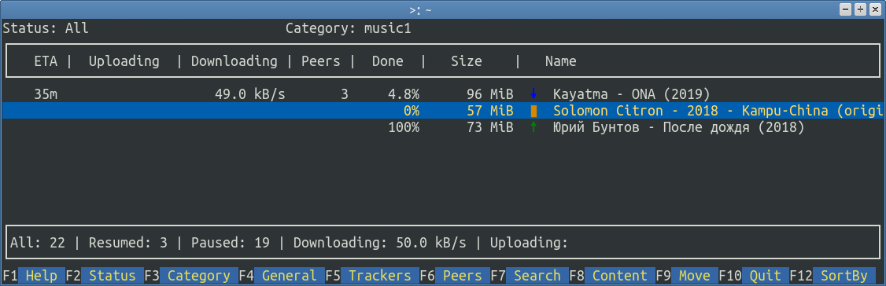
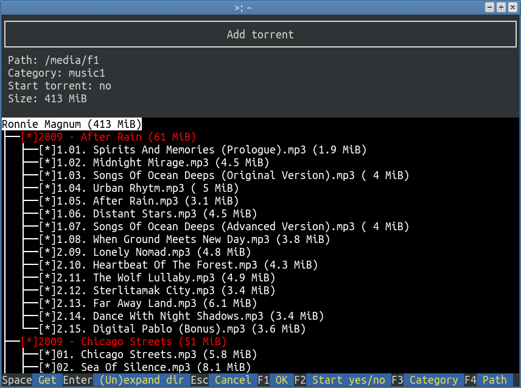

# trango
TUI for the BitTorrent client Transmission.  
Used [tview](https://github.com/rivo/tview) and [bencode](https://github.com/marksamman/bencode) libraries.  
```
go get -u github.com/takiz/trango
```



##Requirements
* [go](https://github.com/golang/go) v1.13 or later
* GNU/Linux or FreeBSD
* [transmission-daemon](https://github.com/transmission/transmission) v3.0 or later for categories support

See `trango --help` for more options.
